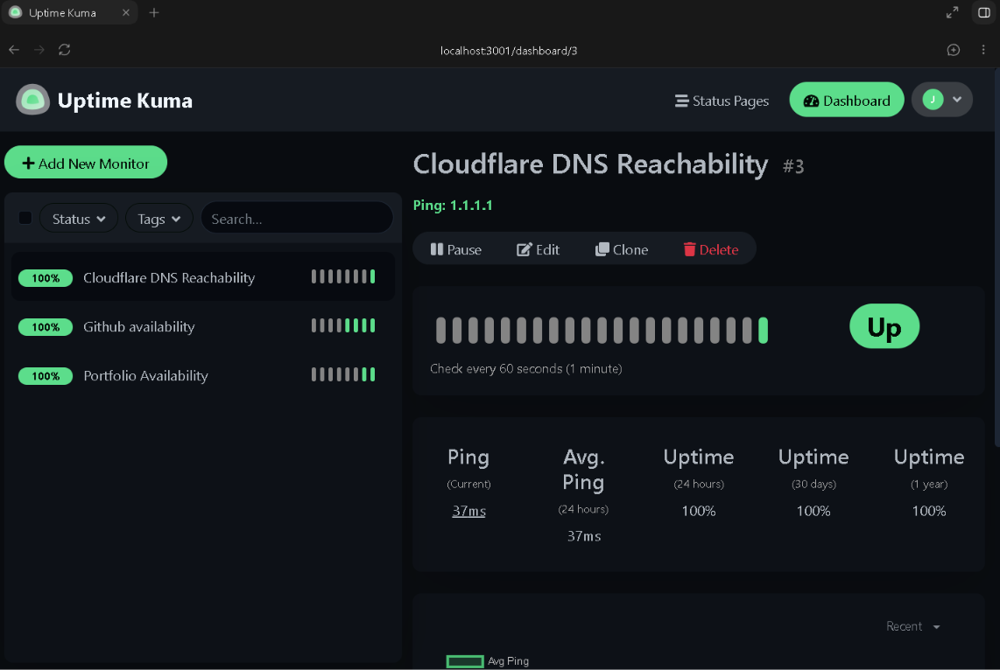
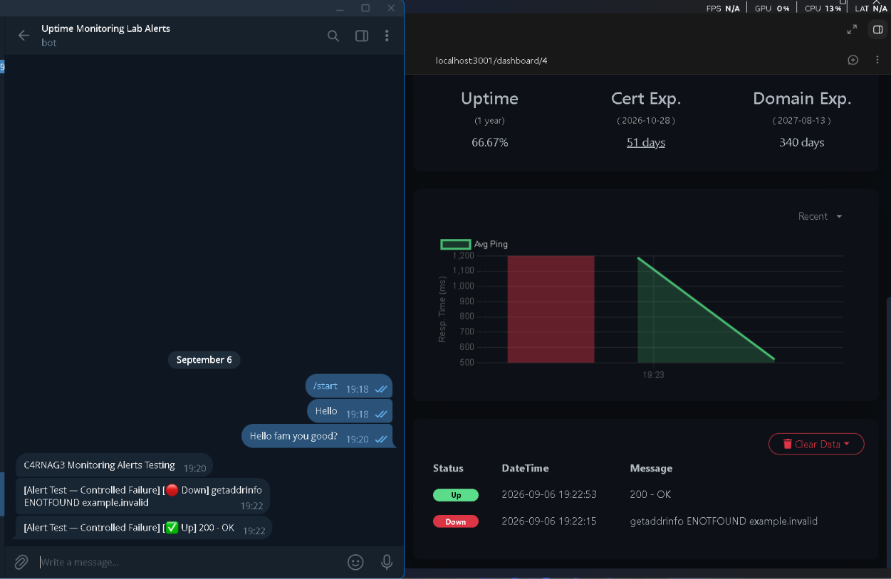

# Self-Hosted Uptime Monitoring Lab

> A lightweight, self-hosted monitoring lab built with Uptime Kuma on Windows without Docker.



## Project overview

This project documents the deployment and configuration of a local Uptime Kuma monitoring instance. It checks the availability of selected public services, records uptime history, and sends a notification when a monitored service fails or recovers.

The goal was to learn practical service monitoring and incident-alerting fundamentals while using a resource-friendly, non-containerized setup.

## What it does

- Checks website availability over HTTP(S).
- Checks network reachability with ping.
- Tracks uptime and response-time history.
- Sends an outage notification and a recovery notification.
- Presents selected safe-to-share checks on a public status page.

## Architecture

```text
Public websites / network endpoints
              |
              v
  Uptime Kuma (Windows local host)
              |
     +--------+--------+
     |                 |
     v                 v
SQLite history     Notification service
and uptime data    (Discord / Telegram / Email)
     |
     v
Selected public status page
```

## Technology stack

| Technology | Purpose |
|---|---|
| Windows 10/11 | Host operating system |
| Uptime Kuma | Open-source monitoring dashboard |
| Node.js | Runs Uptime Kuma directly, without Docker |
| npm | Installs application dependencies |
| Git | Retrieves source code and manages project documentation |
| PM2 | Runs Uptime Kuma in the background |
| SQLite | Local monitor and event-history storage |
| Discord, Telegram, or email | Incident notifications |

## Monitors

The documented monitor plan is in [docs/monitor-inventory.md](docs/monitor-inventory.md).

Screenshots intentionally show only public endpoints. Private IP addresses, internal hostnames, API keys, webhook URLs, and account information are excluded.

## Alert test

I tested the full incident flow using a deliberately invalid URL. The expected outcome was:

1. The monitor changes to **Down**.
2. A failure notification arrives.
3. The monitor is paused or corrected.
4. A recovery notification arrives.

See [docs/alert-test.md](docs/alert-test.md) for the test record.



## Running Uptime Kuma without Docker

Prerequisites: Node.js 20.4 or newer, Git, and PM2.

```powershell
git clone https://github.com/louislam/uptime-kuma.git
cd uptime-kuma
npm run setup
npm install pm2 -g
pm2 start server/server.js --name uptime-kuma
```

The local dashboard is then available at `http://localhost:3001`.

Useful operations:

```powershell
pm2 status
pm2 logs uptime-kuma
pm2 restart uptime-kuma
```

For current requirements and official guidance, see the [Uptime Kuma installation documentation](https://github.com/louislam/uptime-kuma#%EF%B8%8F-non-docker).

## Security considerations

- The administrator dashboard remains local/private.
- Secrets, passwords, notification webhooks, and database files are never committed to Git.
- Only non-sensitive checks are placed on a public status page.
- Screenshots are reviewed before publishing to remove personal information and internal infrastructure details.

## Screenshots

| Image | What it demonstrates |
|---|---|
| [01-dashboard-overview.png](docs/screenshots/01-dashboard-overview.png) | Healthy monitor dashboard |
| [02-monitor-configuration.png](docs/screenshots/02-monitor-configuration.png) | One safe HTTP(S) monitor configuration |
| [03-alert-test.png](docs/screenshots/03-alert-test.png) | Down and recovery alert evidence |
| [04-status-page.png](docs/screenshots/04-status-page.png) | Public status page |
| [05-pm2-status.png](docs/screenshots/05-pm2-status.png) | Background-process status in PowerShell |

## Learning outcomes

- Deploying a self-hosted service without containerization.
- Designing basic uptime checks and selecting sensible intervals.
- Testing incident notification and recovery workflows.
- Distinguishing public operational visibility from private administration.
- Writing reproducible technical documentation.

## Future improvements

- Host the service on a low-cost VPS or home server.
- Add HTTPS with a reverse proxy when exposing a public endpoint.
- Monitor a personal web project or API.
- Add multiple notification destinations and escalation rules.

